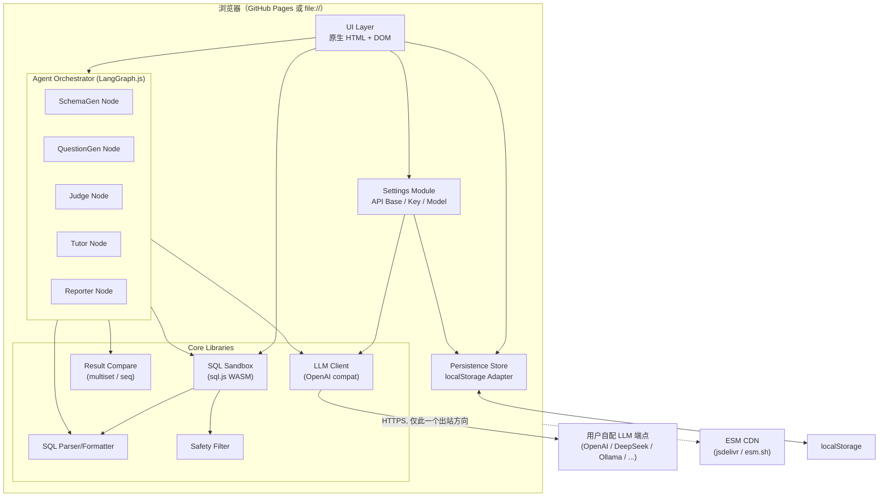
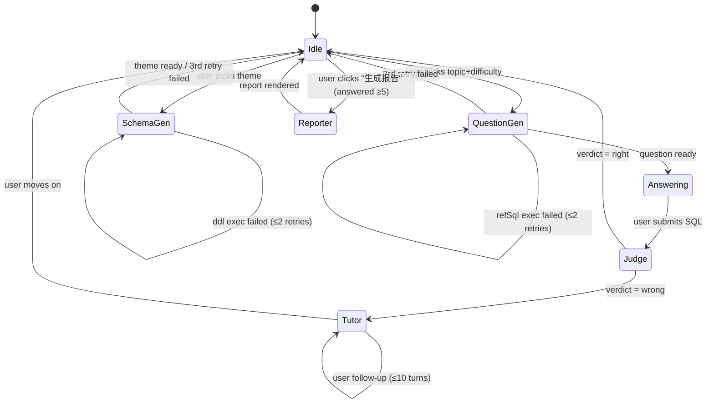
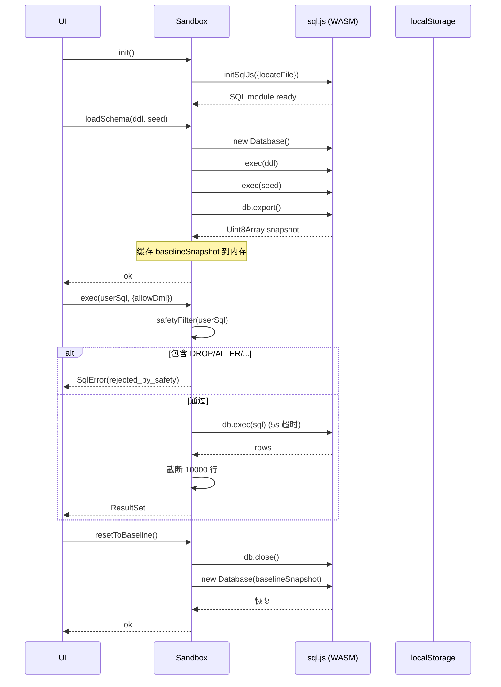
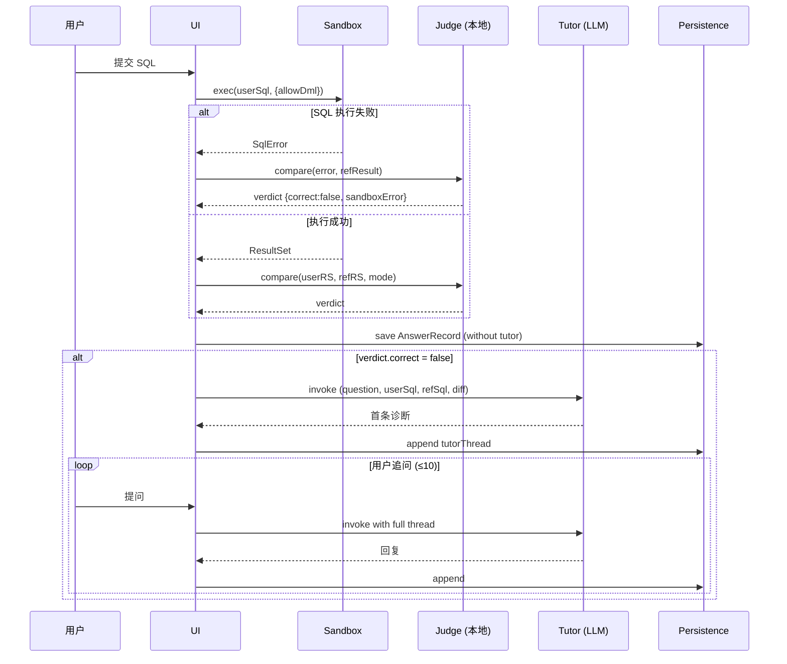
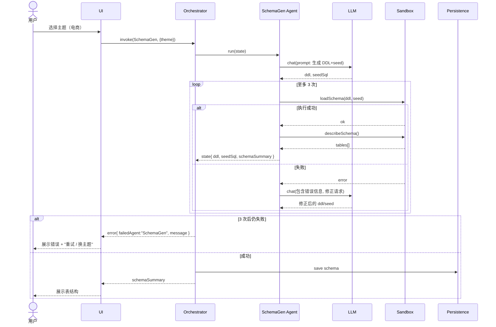
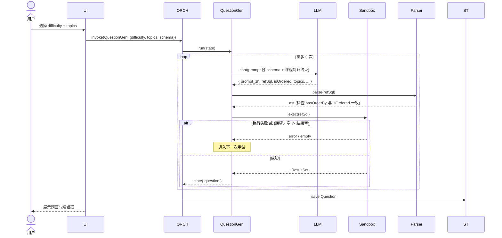
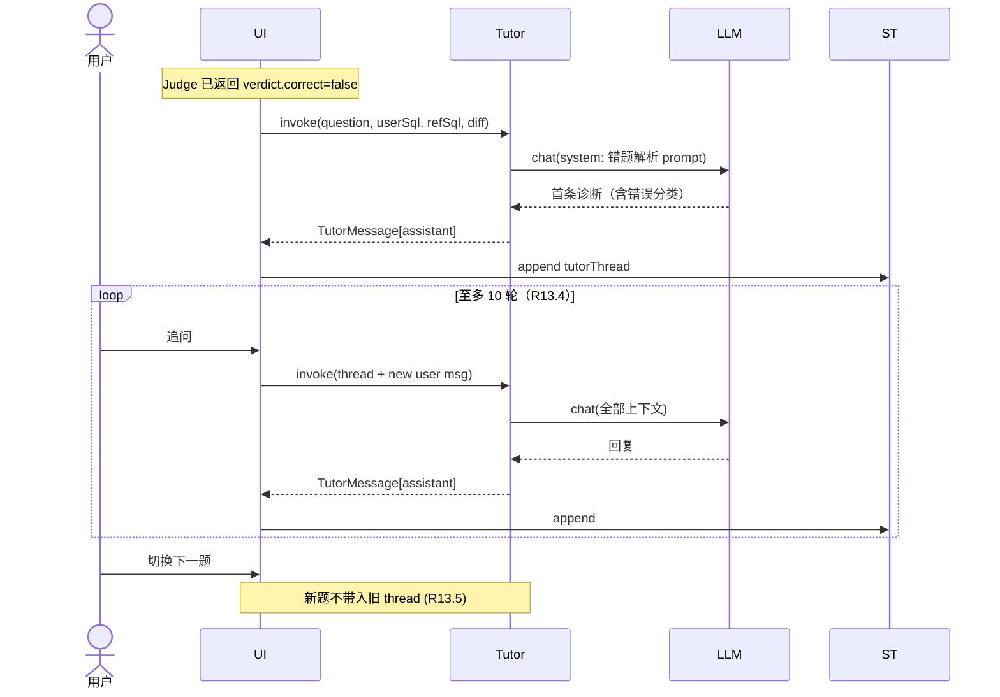

# 设计文档（design.md）

## Overview

SQL_Coach 是一个**纯浏览器端**的 SQL 学习系统：无后端、无构建步骤，可直接通过 `index.html` 或 GitHub Pages 运行。系统由原生 HTML + ESM JavaScript 编写，第三方依赖（LangGraph.js、sql.js）通过 ESM CDN 加载。

核心闭环：**出题 → 答题 → 判题 → 解析答疑 → 报告**，由五个 LangGraph 节点协作：

| Agent | 职责 | 触发时机 |
|---|---|---|
| `SchemaGen_Agent` | 按主题生成 DDL + 种子数据 | 用户选择主题 |
| `QuestionGen_Agent` | 按知识点/难度生成题目 + 参考 SQL + 预期结果集 | 用户点击"出题" |
| `Judge_Agent` | 结果集等价判题（multiset / sequence） | 用户提交 SQL |
| `Tutor_Agent` | 错题诊断 + 多轮答疑 | Judge 返回错误 |
| `Reporter_Agent` | 阶段性能力分析 | 用户主动请求且已答 ≥5 题 |

所有用户敏感信息（API Key、答题记录）只存于 `localStorage`，不向任何第三方域名外泄；LLM 端点由用户自配，遵循 OpenAI Chat Completions 协议。

### 关键设计决策

| # | 决策 | 备选方案 | 选择理由 |
|---|---|---|---|
| D1 | 用 LangGraph.js（浏览器版） | 自研状态机 | LangGraph 提供消息通道、检查点、节点重试，五 Agent 编排成本低；要求 R17.1 强制使用 |
| D2 | 用 sql.js（SQLite WASM） | DuckDB-wasm | sql.js 体积更小、生态成熟；DuckDB 与 MySQL 函数差异更大；课程目标是 SQL 通用语法而非引擎特性 |
| D3 | 仅在 SQLite ∩ MySQL 子集内工作 | 全 SQLite 语法 | 课程对齐 MySQL；R7 强制要求 |
| D4 | 判题在前端纯函数完成（不调 LLM） | LLM 判题 | 结果集语义等价是确定性比较；纯函数稳定、零成本、可 PBT 验证；LLM 不擅长精确表比较 |
| D5 | SQL Parser 用手写 LL 子集解析器（仅识别语句类型与 ORDER BY） | 引入 node-sql-parser | 仅需粗粒度结构（R18.1），手写 ~300 行避免 18MB 依赖与 CommonJS/ESM 兼容问题 |
| D6 | UI 用原生 DOM + 模板字符串 | React/Vue | R4 禁止构建步骤；少量交互用原生 DOM 足够 |
| D7 | 用户 SQL 安全过滤在执行前完成 | 沙箱权限隔离 | sql.js 无内置权限模型；正则 + AST 双层检查最简单（R11） |
| D8 | 题目种子数据快照通过 sql.js `db.export()` 实现 | INSERT 重放 | `export()` 返回完整字节快照，重置时 `new SQL.Database(snapshot)` 即可 O(1) 还原（R10.6/R11.4） |

---

## Architecture

### 高层结构



**出站请求约束**（R2.2 / R4.4）：浏览器只对两类目标发请求——

1. **CDN**（仅启动时一次性加载 ESM 依赖；不带 API Key）
2. **用户自配 LLM 端点**（携带 API Key）

绝不向任何第三方分析、错误上报、telemetry 服务出站。

### 文件结构

```
/  (仓库根 = GitHub Pages 根)
├── index.html                  入口页面
├── manifest.json               PWA 元信息（可选）
├── styles/
│   └── main.css
├── src/
│   ├── main.js                 应用启动 / 路由
│   ├── ui/
│   │   ├── settings-view.js    设置界面
│   │   ├── practice-view.js    主练习界面
│   │   ├── editor-view.js      SQL 编辑器（textarea + 语法高亮）
│   │   ├── result-view.js      结果集表格
│   │   ├── tutor-view.js       Tutor 对话框
│   │   ├── history-view.js     历史 / 错题
│   │   └── report-view.js      报告
│   ├── orchestrator/
│   │   ├── graph.js            LangGraph 图定义（5 节点）
│   │   ├── state.js            AgentState 类型与序列化
│   │   ├── nodes/
│   │   │   ├── schema-gen.js
│   │   │   ├── question-gen.js
│   │   │   ├── judge.js
│   │   │   ├── tutor.js
│   │   │   └── reporter.js
│   │   └── prompts/            每个节点的 system/few-shot 提示词
│   ├── sandbox/
│   │   ├── sandbox.js          sql.js 包装：load / exec / reset / snapshot
│   │   ├── safety-filter.js    DDL/DML 拒绝清单
│   │   └── timeout.js          5s 执行超时（基于 setTimeout + interrupt）
│   ├── sql/
│   │   ├── parser.js           手写解析器（语句类型 + ORDER BY 检测）
│   │   ├── formatter.js        格式化
│   │   ├── tokenizer.js        词法
│   │   └── ast.js              AST 节点定义
│   ├── judge/
│   │   ├── compare.js          multiset / sequence 等价
│   │   ├── normalize.js        值类型规范化（数值/字符串/null）
│   │   └── diff.js             差异摘要
│   ├── llm/
│   │   ├── client.js           fetch 封装 + 60s 超时 + AbortController
│   │   └── errors.js           错误分类（401/429/5xx/CORS/timeout）
│   ├── persist/
│   │   ├── store.js            localStorage Adapter
│   │   ├── schema.js           键名常量与 schema 版本号
│   │   └── migrate.js          schema 迁移
│   ├── i18n/
│   │   └── zh.js               中文文案
│   └── data/
│       └── topics.js           16 个 Question_Topic 元数据
├── vendor/                     如需离线兜底，将 ESM 依赖镜像于此
│   ├── langgraph.esm.js
│   └── sql.js / sql-wasm.wasm
└── README.md
```

> **vendor/ 是可选的**。默认通过 `https://esm.sh/@langchain/langgraph` 与 `https://cdn.jsdelivr.net/npm/sql.js` 加载。如需 GitHub Pages 完全离线可用，可把这两个文件镜像进 `vendor/` 并在 `index.html` 中切换 importmap。

### LangGraph 拓扑



LangGraph 中每个节点是一个 `async (state) => state'` 的纯函数。状态对象 `AgentState` 通过 immutable 更新（spread）传递，避免节点间隐式共享可变引用（R17.3）。

---

## Components and Interfaces

### Settings_Module

**职责**：管理 LLM 配置；提供测试连接；负责掩码显示与凭据隔离（R1, R2, R3）。

```ts
// 接口契约（实际为 JSDoc 类型，下同）
interface LlmConfig {
  apiBaseUrl: string;        // e.g. "https://api.openai.com/v1"
  apiKey: string;            // 仅存 localStorage，UI 默认掩码
  modelName: string;         // e.g. "gpt-4o-mini"
}

interface SettingsModule {
  load(): LlmConfig | null;
  save(cfg: LlmConfig): void;
  clear(): void;                                  // R2.3
  testConnection(cfg: LlmConfig): Promise<{
    ok: boolean;
    latencyMs: number;
    error?: ClassifiedLlmError;                   // R1.6, 10s 超时
  }>;
  isComplete(cfg: LlmConfig | null): boolean;     // R1.5 判定
}
```

**测试连接最小请求**：`POST {apiBaseUrl}/chat/completions` body `{model, messages: [{role:"user", content:"ping"}], max_tokens: 1}`，10 秒 AbortController 截断。

### Agent_Orchestrator

**职责**：通过 LangGraph.js 编排 5 个 Agent；统一 LLM 调用、错误处理、retry 计数（R17）。

```ts
interface AgentState {
  // 设置
  llm: LlmConfig;

  // Schema 阶段
  theme: Theme;
  themeDescription?: string;        // 自定义主题中文描述
  ddl?: string;
  seedSql?: string;
  schemaSummary?: TableSchema[];

  // Question 阶段
  question?: Question;

  // Answer 阶段
  userSql?: string;
  userResult?: ResultSet | SqlError;

  // Judge 阶段
  verdict?: JudgeVerdict;

  // Tutor 阶段
  tutorThread?: TutorMessage[];

  // Session 元数据
  sessionId: string;
  history: AnswerRecord[];

  // 错误传递
  failedAgent?: 'SchemaGen' | 'QuestionGen' | 'Judge' | 'Tutor' | 'Reporter';
  error?: ClassifiedLlmError | string;
}
```

每个节点以 `async (state) => Partial<AgentState>` 形式实现，由 LangGraph 合并到全局状态。

### SQL_Sandbox

**职责**：在浏览器内执行用户与 Agent 提交的 SQL；管理初始快照；强制安全过滤与超时（R10, R11）。

```ts
interface Sandbox {
  /** 加载 sql.js WASM；幂等。 */
  init(): Promise<void>;

  /** 用 DDL+seed 创建数据库；同时记录 baseline 快照。 */
  loadSchema(ddl: string, seedSql: string): Promise<{ ok: boolean; error?: string }>;

  /** 当前数据库的字节快照（sql.js Database.export() 的 Uint8Array）。 */
  exportSnapshot(): Uint8Array;

  /** 用快照重建数据库实例；O(1) 还原（R10.6, R11.4）。 */
  restoreSnapshot(bytes: Uint8Array): void;

  /**
   * 执行 SQL：
   * - allowDml: 当前题目允许 INSERT/UPDATE/DELETE 时为 true（R11.2）
   * - 超时 5s（R10.2, R11.3）
   * - 行数上限 10000（R10.5）
   */
  exec(sql: string, opts: {
    allowDml: boolean;
    timeoutMs?: number; // default 5000
    rowLimit?: number;  // default 10000
  }): Promise<ResultSet | SqlError>;

  /** 列出当前所有表的结构（R6.8）。 */
  describeSchema(): TableSchema[];
}

interface SqlError {
  kind: 'syntax' | 'runtime' | 'timeout' | 'rejected_by_safety' | 'row_limit_exceeded';
  message: string;
}
```

#### 沙箱生命周期与快照



**超时实现**：sql.js 的 `db.exec` 是同步的，主线程不能 cancel。生产实现把 sandbox 放到 Web Worker 里，`exec` 通过 `postMessage` 触发；超时由主线程 `setTimeout` 控制，到点就 `worker.terminate()` 并用 baseline snapshot 在新 Worker 中重启。这样既满足 R10.2/R11.3 的 5s 超时，又不会卡死 UI。

### SQL Parser & Formatter

**职责**：粗粒度语法识别（语句类型、是否含 ORDER BY、是否含禁用关键字）+ 格式化（R18）。

```ts
type StmtKind = 'SELECT' | 'INSERT' | 'UPDATE' | 'DELETE' | 'DDL' | 'OTHER';

interface SqlAst {
  kind: StmtKind;
  hasOrderBy: boolean;
  hasGroupBy: boolean;
  hasHaving: boolean;
  hasJoin: boolean;
  hasSubquery: boolean;
  hasExists: boolean;
  hasSetOp: 'UNION' | 'INTERSECT' | 'EXCEPT' | null;
  // 原始 token 序列，formatter 用
  tokens: Token[];
}

interface SqlParser {
  parse(sql: string): SqlAst | { error: string };
  format(ast: SqlAst): string;
}
```

**实现策略**：tokenize → 自顶向下识别关键字标志位。不构建完整表达式 AST（开销过大且课程不需要）。`format` 基于 token 流做缩进与换行：每个主子句（`SELECT` / `FROM` / `WHERE` / `GROUP BY` / `HAVING` / `ORDER BY` / `LIMIT`）顶格，子查询缩进 2 空格。

**往返一致性**（R18.4）：对任何合法参考 SQL，`parse → format → parse` 必须产生 token 序列等价的 AST（忽略空白）。这是核心 PBT 属性之一。

### Safety Filter

```ts
const FORBIDDEN_KEYWORDS = ['DROP', 'ALTER', 'TRUNCATE', 'ATTACH', 'DETACH', 'PRAGMA'];
const DML_KEYWORDS = ['INSERT', 'UPDATE', 'DELETE', 'REPLACE'];

function safetyFilter(sql: string, allowDml: boolean): { ok: boolean; reason?: string } {
  const ast = parser.parse(sql);
  // 双重保险：AST kind 检查 + 正则关键字检查
  if (ast.kind === 'DDL' || containsForbidden(ast.tokens)) return { ok: false, reason: '...' };
  if (!allowDml && (DML_KEYWORDS.includes(ast.kind))) return { ok: false, reason: '...' };
  return { ok: true };
}
```

**注意**：检查基于 token 流而非字符串 `includes`，避免字符串字面量里出现 `"DROP"` 被误杀。

### Judge 引擎

**职责**：纯前端结果集等价比较；不调 LLM（R12）。

```ts
type CompareMode = 'multiset' | 'sequence';

interface ResultSet {
  columns: string[];
  rows: SqlValue[][];     // 二维数组
  truncated?: boolean;    // R10.5 行截断标记
}

interface JudgeVerdict {
  correct: boolean;
  diffSummary?: {
    extraRows: number;       // 用户多出的行
    missingRows: number;     // 参考多出但用户缺失的行
    firstMismatch?: { rowIndex: number; expected: SqlValue[]; actual: SqlValue[] };
  };
  sandboxError?: SqlError;   // R12.7
}

interface Judge {
  compare(user: ResultSet, ref: ResultSet, mode: CompareMode): JudgeVerdict;
}
```

**算法**：

- `sequence`：列数检查 → 逐行 `arrayEquals(normalize(userRow), normalize(refRow))`
- `multiset`：列数检查 → 把每行序列化为 canonical key（列值规范化后 JSON 串）→ 用 Map<key, count> 比较两个多重集
- `normalize` 规则：
  - 数值：`12 == 12.0`（用 `Number(x)` 后比较）
  - 字符串：原样比较，不去空格（贴近 SQL 语义；如有特殊需求由题面说明）
  - `null` 与 `''` 严格区分
  - SQLite 返回的 `BLOB` 用 base64 化字符串

**列名宽容**（R12.4）：不要求列名相同；只要求列数相同、对应位置可比较。

**`set_vs_join_compare`**（R12.8）：用户提交两段 SQL，分别 exec → 各自与 refResultSet 比较 → 两段都正确才整体正确。

#### 答题判题流程



### LLM Client

```ts
interface LlmClient {
  chat(messages: ChatMessage[], opts?: {
    timeoutMs?: number;     // default 60000 (R3.3)
    temperature?: number;
    responseFormat?: 'text' | 'json_object';
  }): Promise<{ content: string }>;
}

type ClassifiedLlmError =
  | { kind: 'unauthorized'; status: 401 | 403; message: string }     // R14.1
  | { kind: 'rate_limited'; status: 429; retryAfterMs?: number; message: string } // R14.2
  | { kind: 'server_error'; status: 500 | 502 | 503 | 504; message: string }      // R14.3
  | { kind: 'timeout'; message: string }                                          // R14.4 / R3.3
  | { kind: 'cors'; message: string }                                             // R3.1
  | { kind: 'network'; message: string }
  | { kind: 'bad_response'; message: string };
```

**CORS 检测启发式**：`fetch` 在跨域被拒时抛 `TypeError`，且 `error.message` 通常含 `"Failed to fetch"` 而 `response` 为 `undefined`。结合"请求确实发出但无 response 头" → 归类为 `cors`。提示文案显式包含"CORS"字样（R3.1）。

**优先级**（R14.6）：`unauthorized > rate_limited > server_error > timeout > cors > network > bad_response`。同一请求只展示最高优先级的一条。

### Persistence Store

```ts
interface PersistKey {
  SETTINGS: 'sqlcoach.settings.v1';
  CURRENT_SCHEMA: 'sqlcoach.schema.v1';
  QUESTION_BANK: 'sqlcoach.questions.v1';
  ANSWERS: 'sqlcoach.answers.v1';
  SESSIONS: 'sqlcoach.sessions.v1';
  SCHEMA_VERSION: 'sqlcoach.meta.schemaVersion';
}

interface Store {
  get<T>(key: string): T | null;
  set<T>(key: string, value: T): { ok: boolean; quotaExceeded?: boolean }; // R15.6
  remove(key: string): void;
  exportAll(): string; // JSON 字符串（导出/兜底用）
  importAll(json: string): { ok: boolean; error?: string };
}
```

**配额耗尽兜底**（R15.6）：`set` 抛 `QuotaExceededError` 时返回 `{ok:false, quotaExceeded:true}`，UI 弹出"保存失败 / 导出 JSON"对话框。

**localStorage 禁用**（R2.5）：启动时尝试 `setItem('__probe__', '1')`；失败则切换为内存 Map 适配器并显示横幅。

---

## Data Models

### 核心类型

```ts
// === 主题 ===
type Theme = 'ecommerce' | 'campus' | 'library' | 'hospital' | 'custom';

// === 难度 ===
type DifficultyLevel = 'L1' | 'L2' | 'L3' | 'L4';

// === 知识点（16 类，与术语表一致） ===
type QuestionTopic =
  | 'single_table_select' | 'where_filter' | 'order_by_limit'
  | 'aggregate_function'
  | 'join_inner' | 'join_outer' | 'join_self'
  | 'group_by_having'
  | 'subquery' | 'correlated_subquery'
  | 'exists_not_exists' | 'universal_quantifier'
  | 'set_operation_union' | 'set_operation_intersect' | 'set_operation_except'
  | 'set_vs_join_compare';

// === Schema ===
interface TableSchema {
  name: string;                // 英文表名 (R5.2)
  columns: ColumnSchema[];
  primaryKey: string[];
  foreignKeys: { columns: string[]; refTable: string; refColumns: string[] }[];
}
interface ColumnSchema {
  name: string;
  type: string;                // VARCHAR(N) | INT | DECIMAL(P,S) | DATE | DATETIME | TEXT
  nullable: boolean;
  default?: string;
}

// === 题目 ===
interface Question {
  id: string;                  // ulid
  createdAt: number;
  difficulty: DifficultyLevel;
  topics: QuestionTopic[];     // L4 至少 2 个 (R8.5)
  prompt: string;              // 中文题面
  refSql: string;              // 英文 SQL (R5.3)
  // set_vs_join_compare 专用：用户需提交两段 SQL
  refSqlAlt?: string;          // 替代写法（集合 vs 连接）(R9.6)
  expectedResult: ResultSet;
  isOrdered: boolean;          // R19.1
  schemaRef: string;           // 关联的 Schema id
}

// === 作答记录 ===
interface AnswerRecord {
  id: string;
  questionId: string;
  sessionId: string;
  submittedAt: number;
  userSql: string;
  userSqlAlt?: string;         // set_vs_join_compare 时的第二段
  userResultSummary: { rowCount: number; columns: string[]; truncated: boolean }
                  | { error: string };
  verdict: JudgeVerdict;
  tutorThread: TutorMessage[];
}

interface TutorMessage {
  role: 'user' | 'assistant';
  content: string;
  at: number;
}

// === 会话 ===
interface Session {
  id: string;
  startedAt: number;
  endedAt?: number;
  schemaRef: string;
  answerIds: string[];
}

// === LLM 配置 ===  // 见 Settings_Module
```

### MySQL 兼容子集（MySQL_Compatible_Subset）规约

| 类别 | 允许 | 禁止 |
|---|---|---|
| **DDL** | `CREATE TABLE`、`PRIMARY KEY`、`FOREIGN KEY ... REFERENCES`、`UNIQUE`、`NOT NULL`、`DEFAULT` | `WITHOUT ROWID`、`AUTOINCREMENT`（用 `INTEGER PRIMARY KEY` 自增等价）、`CHECK` 约束（SQLite 弱、MySQL ≥8 行为不一致）、`PRAGMA` |
| **类型** | `INT`/`INTEGER`、`BIGINT`、`DECIMAL(p,s)`、`VARCHAR(n)`、`CHAR(n)`、`TEXT`、`DATE`、`DATETIME`、`BOOLEAN` (映射 0/1) | SQLite 的"动态类型亲和"（生成 SQL 时严格遵守类型） |
| **DML** | `INSERT INTO ... VALUES (...)`，多值 INSERT | `INSERT OR REPLACE`、`UPSERT` |
| **查询** | `SELECT`、`WHERE`、`GROUP BY`、`HAVING`、`ORDER BY`、`LIMIT n [OFFSET m]`、`JOIN ON`、`LEFT JOIN`、`UNION [ALL]`、`INTERSECT`、`EXCEPT` | SQLite 专属：`IIF`、`PRINTF`、`GLOB`、`MATCH`、`LIKELIHOOD`；MySQL 专属：`STRAIGHT_JOIN`、`SQL_CALC_FOUND_ROWS` |
| **函数** | `COUNT/SUM/AVG/MIN/MAX`、`UPPER/LOWER/LENGTH/SUBSTR/TRIM`、`COALESCE/IFNULL`、`CAST`、`CASE WHEN`、`ROUND/ABS/CEIL/FLOOR`、`DATE/STRFTIME`（SQLite 写 `STRFTIME` → 题面注明在 MySQL 下用 `DATE_FORMAT`） | `IIF` → 用 `CASE WHEN` 代替 |
| **EXCEPT** | sql.js 支持原生 `EXCEPT`；题面 SHALL 注明 MySQL 不支持，需用 `NOT IN` 或 `NOT EXISTS` 等价改写（R7.4） | — |

文档 `README.md` 中将以表格形式公开此清单（R7.3）。

### 16 知识点 Taxonomy

```js
// src/data/topics.js
export const TOPICS = [
  { id: 'single_table_select', zh: '单表查询', minLevel: 'L1', exampleSeed: 'SELECT * FROM ...' },
  { id: 'where_filter',        zh: 'WHERE 过滤', minLevel: 'L1' },
  { id: 'order_by_limit',      zh: '排序与分页', minLevel: 'L1', isOrderedHint: true },
  { id: 'aggregate_function',  zh: '聚合函数', minLevel: 'L2' },
  { id: 'join_inner',          zh: '内连接', minLevel: 'L2' },
  { id: 'join_outer',          zh: '外连接', minLevel: 'L2' },
  { id: 'join_self',           zh: '自连接', minLevel: 'L2' },
  { id: 'group_by_having',     zh: '分组与 HAVING', minLevel: 'L2' },     // 课程重点
  { id: 'subquery',            zh: '子查询', minLevel: 'L2' },
  { id: 'correlated_subquery', zh: '相关子查询', minLevel: 'L3' },        // 课程重点
  { id: 'exists_not_exists',   zh: 'EXISTS / NOT EXISTS', minLevel: 'L3' }, // 课程重点
  { id: 'universal_quantifier',zh: '全称量词转化', minLevel: 'L3' },      // 课程重点
  { id: 'set_operation_union', zh: '集合运算 UNION', minLevel: 'L2' },
  { id: 'set_operation_intersect', zh: '集合运算 INTERSECT', minLevel: 'L3' },
  { id: 'set_operation_except',zh: '集合运算 EXCEPT / 差集', minLevel: 'L3' }, // 课程重点
  { id: 'set_vs_join_compare', zh: '集合查询 vs 连接查询对比', minLevel: 'L4' }, // 课程重点
];
```

L3/L4 难度分发逻辑（R8.4 / R8.5）由 `QuestionGen_Agent` 在 prompt 模板里强约束，并在节点出口做后置校验：

- L3 出题：题目 `topics ∩ {correlated_subquery, exists_not_exists, universal_quantifier, set_operation_except} ≠ ∅`
- L4 出题：`|topics| ≥ 2`

不满足则在节点内重试（计入 R8.7 的 retry 上限）。

### localStorage 实际 Schema

```jsonc
// key: sqlcoach.settings.v1
{
  "apiBaseUrl": "https://api.deepseek.com/v1",
  "apiKey": "sk-***",
  "modelName": "deepseek-chat"
}

// key: sqlcoach.schema.v1
{
  "id": "01HXYZ...",
  "theme": "ecommerce",
  "themeDescription": null,
  "ddl": "CREATE TABLE ...",
  "seedSql": "INSERT INTO ...",
  "tables": [{ /* TableSchema */ }],
  "createdAt": 1731000000000
}

// key: sqlcoach.questions.v1   (按 schema.id 归档)
{
  "<schemaId>": [
    { /* Question */ },
    ...
  ]
}

// key: sqlcoach.answers.v1
[
  { /* AnswerRecord */ },
  ...
]

// key: sqlcoach.sessions.v1
[
  { /* Session */ }
]

// key: sqlcoach.meta.schemaVersion
1
```

> **不持久化沙箱字节快照**：sql.js 数据库可能很大（>1MB），存进 localStorage 既慢又容易爆 5MB 配额。重启时若需要恢复练习，用 `ddl + seedSql` 重新建库即可（确定性）。

### 序列图：主题选择流程（SchemaGen）



### 序列图：出题流程（QuestionGen）



### 序列图：Tutor 多轮答疑




---

## Correctness Properties

> A property is a characteristic or behavior that should hold true across all valid executions of a system — essentially, a formal statement about what the system should do. Properties serve as the bridge between human-readable specifications and machine-verifiable correctness guarantees.

下列属性来自 prework 阶段的分类与去重。每条都对应纯函数或确定性逻辑（解析器、判题器、错误分类、安全过滤、持久化、状态机），适合用 fast-check / `@fast-check/vitest` 在浏览器环境运行 ≥100 次随机迭代。LLM 调用本身的内容质量不在 PBT 范围内，但 LLM 调用的**外壳**（出站白名单、提示词结构、错误分类、retry 计数）是属性可达的。

### Property 1: SQL 解析-格式化-解析 往返一致性

*For any* 由 `QuestionGen_Agent` 生成的合法参考 SQL `s`，以及任何手写的合法 MySQL 兼容子集 SQL，`parse(format(parse(s)))` 产生的 AST 在所有语义标志位（`kind`、`hasOrderBy`、`hasGroupBy`、`hasHaving`、`hasJoin`、`hasSubquery`、`hasExists`、`hasSetOp`）上必须与 `parse(s)` 等价。

**Validates: Requirements 18.1, 18.2, 18.4**

### Property 2: 出站请求白名单

*For any* 完整的 `LlmConfig cfg` 与任意 Agent 调用序列，全局 `fetch` / `XMLHttpRequest` 出站请求的目标 origin 必须属于集合 `{ originOf(cfg.apiBaseUrl) } ∪ CDN_ALLOWLIST`，且只有指向 `originOf(cfg.apiBaseUrl)` 的请求才允许携带 `Authorization` 头或 `cfg.apiKey` 的任何子串；其他出站请求的请求体与请求头都不得包含 `cfg.apiKey`。

**Validates: Requirements 1.3, 2.2, 2.4, 4.4, 10.1**

### Property 3: 凭据持久化往返与清除

*For any* 合法的 `LlmConfig cfg`，依次执行 `Settings.save(cfg)` 后 `Settings.load()` 返回的对象与 `cfg` 在 `apiBaseUrl`/`apiKey`/`modelName` 三字段上严格相等；进一步执行 `Settings.clear()` 后再 `Settings.load()` 返回 `null`，且 `localStorage` 不再包含 `cfg.apiKey` 子串。

**Validates: Requirements 1.2, 2.1, 2.3, 15.5**

### Property 4: LLM 错误分类的覆盖与互斥

*For any* HTTP 响应 `r`（含 status code、headers）或网络异常 `e`，`classifyError(r ?? e)` 返回的 `kind` 必须满足：
- `r.status ∈ {401, 403}` ⇒ `kind = 'unauthorized'`
- `r.status = 429` ⇒ `kind = 'rate_limited'`
- `r.status ∈ [500, 599]` ⇒ `kind = 'server_error'`
- `e` 为 `AbortError` 且原因为超时 ⇒ `kind = 'timeout'`
- `e` 为 `TypeError("Failed to fetch")` 且无 response ⇒ `kind = 'cors'`
此外，对任意错误标志集合 `S`，`displayedError(S)` 必须等于 `S` 中按优先级 `unauthorized > rate_limited > server_error > timeout > cors > network > bad_response` 取最高项；`S = ∅` 时返回 `null`，UI 不展示任何错误。

**Validates: Requirements 3.1, 3.3, 14.1, 14.2, 14.3, 14.4, 14.6**

### Property 5: 沙箱重置幂等性

*For any* 已加载 schema 的沙箱（baseline snapshot 已建立）和任意通过安全过滤的 DML 序列 `ops`（INSERT/UPDATE/DELETE 的任意排列与重复），执行 `for op in ops: exec(op, {allowDml:true})` 后调用 `resetToBaseline()`，再对每张表执行 `SELECT * FROM <table>`，结果集与初始 baseline 在 multiset 语义下严格相等；此外连续多次 `resetToBaseline()` 与单次 `resetToBaseline()` 等价（幂等）。

**Validates: Requirements 10.6, 11.4**

### Property 6: 安全过滤的精确性

*For any* SQL 字符串 `s`：`safetyFilter(s, allowDml)` 当且仅当满足以下任一条件时返回 `ok=false`：(a) `s` 的 token 流（剔除字符串/注释字面量后）包含 `DROP`/`ALTER`/`TRUNCATE`/`ATTACH`/`DETACH`/`PRAGMA`；(b) `allowDml=false` 且 `parse(s).kind ∈ {INSERT, UPDATE, DELETE}`。换言之：对所有不含禁用关键字的纯 SELECT 语句，过滤器**永远不**误拒；对所有命中上述条件的 SQL，过滤器**永远不**漏放。

**Validates: Requirements 11.1, 11.2**

### Property 7: 结果集等价比较的对称性、自反性与模式正确性

*For any* 结果集 `r`、置换函数 `π`（行序排列）与列名替换 `ρ`（保持列数与列值类型）：

- 自反与列名宽容：`compare(ρ(r), r, *) ` 判定为 `correct = true`
- 多重集模式：`compare(π(r), r, 'multiset')` 判定为 `correct = true`
- 序列模式（`r` 至少 2 行且 `π` 非恒等）：`compare(π(r), r, 'sequence')` 判定为 `correct = false`
- 对称性：`compare(a, b, m).correct === compare(b, a, m).correct`
- 不等价时差异摘要非空：当 `compare(a, b, m).correct = false` 且 `b` 不是 `SqlError`，`diffSummary.extraRows + diffSummary.missingRows ≥ 1`

**Validates: Requirements 12.1, 12.2, 12.3, 12.4, 12.5, 12.6, 19.4**

### Property 8: 难度/题型/排序后置校验

*For any* 由 `QuestionGen_Agent` 输出并通过节点出口校验的题目 `q`：

- `q.difficulty = 'L3'` ⇒ `q.topics ∩ {correlated_subquery, exists_not_exists, universal_quantifier, set_operation_except} ≠ ∅`
- `q.difficulty = 'L4'` ⇒ `|q.topics| ≥ 2`
- `parse(q.refSql).hasOrderBy ∨ promptHasOrderHint(q.prompt)` ⇔ `q.isOrdered = true`
- 对每个 `t ∈ q.topics`，`parse(q.refSql)` 满足 `t` 的 AST 谓词（如 `t = 'group_by_having'` ⇒ `hasGroupBy ∧ hasHaving`；`t = 'exists_not_exists'` ⇒ `hasExists`；`t = 'set_operation_*'` ⇒ `hasSetOp = '...'` 等）
- `q.refSql` 仅包含 ASCII 字符；`q.prompt` 至少包含一个 CJK 字符
- `t = 'set_operation_except'` ⇒ `q.prompt` 同时包含 `MySQL` 与 (`NOT IN` 或 `NOT EXISTS`) 子串

**Validates: Requirements 5.2, 5.3, 7.4, 8.4, 8.5, 9.1, 9.2, 9.3, 9.4, 9.5, 9.6, 19.1, 19.2, 19.3**

### Property 9: Agent retry 计数与失败传播

*For any* Agent 节点 `n ∈ {SchemaGen, QuestionGen}`、模拟 LLM 在第 `k` 次（`k ∈ {1,2,3}`）调用返回合法可执行结果，节点最终成功且对 LLM 的实际调用次数 ≤ `k`；当 mock LLM 三次都返回不可执行结果时，节点必返回失败并设置 `state.failedAgent = n` 与可读错误消息，且 LLM 调用次数恰好等于 3。对任意节点 `n`，注入抛异常 ⇒ Orchestrator 中止后续节点 ∧ `state.failedAgent = n.name` ∧ UI 渲染含该名称的错误。

**Validates: Requirements 6.4, 6.5, 8.7, 8.8, 17.4**

### Property 10: 上下文隔离与持久化往返

*For any* Tutor 多轮会话序列，对题目 `q1` 的 `n` 轮追问后切换到 `q2`，`q2` 首轮发往 LLM 的 `messages` 数组中既不包含 `q1.userSql` 也不包含 `q1.refSql` 的任何字符（按子串包含意义）；同一会话内的第 `i` 轮（`i ≥ 2`）`messages` 必须包含前 `i-1` 轮的全部 `TutorMessage`。同时，对任意 `Question q` 与 `AnswerRecord a`，`store.set(K, x); reload(); store.get(K)` 返回与 `x` 深度相等的对象。

**Validates: Requirements 13.3, 13.4, 13.5, 15.1, 15.2, 15.3**

### Property 11: 历史排序与过滤分区

*For any* 长度为 `n` 的 `AnswerRecord` 列表 `rs`，UI 渲染序列严格按 `submittedAt` 降序；过滤函数 `filterWrong(rs)` 满足 `filterWrong(rs) ⊆ rs` ∧ `∀ r ∈ filterWrong(rs): r.verdict.correct = false` ∧ `|filterWrong(rs)| = |{r ∈ rs : r.verdict.correct = false}|`；`filterWrong(rs) = ∅` 时 UI 必须渲染包含字符串"没有符合条件的错题"的空状态视图。`clearHistory()` 后 `Settings.load()` 必须仍然返回 `clearHistory` 之前的同一对象。

**Validates: Requirements 15.4, 15.5**

### Property 12: 持久化失败 ⇔ 导出入口可见

*For any* `Persistence.set(key, value)` 调用，UI 显示"导出 JSON"对话框 当且仅当 `set` 返回 `{ ok: false, quotaExceeded: true }`。当 `set` 返回 `{ ok: true }` 时，UI 必须不展示该对话框，也不展示"保存失败"提示。

**Validates: Requirements 15.6**

---

## Error Handling

### LLM 错误（Property 4 覆盖）

| 触发条件 | 分类 | UI 表现 | 是否可重试 |
|---|---|---|---|
| HTTP 401 / 403 | `unauthorized` | "API Key 无效或无权限" + "去设置"按钮 | ❌ 仅去设置（R14.1） |
| HTTP 429 | `rate_limited` | "当前被限流" + "稍后重试"按钮 | ✅ |
| HTTP 5xx | `server_error` | "服务端错误" + "重试"按钮 | ✅ |
| 超时（60s） | `timeout` | "请求超时" + "重试"按钮 | ✅ |
| `TypeError("Failed to fetch")` 且无 response | `cors` | 提示包含"CORS"字样 + 检查端点跨域设置（R3.1） | ❌（需用户先修配置） |
| 其他网络异常 | `network` | 通用网络错误 + 重试 | ✅ |
| LLM 返回内容非 JSON（当要求 JSON 时）或缺字段 | `bad_response` | "模型返回格式异常" + 重试 | ✅ |

**优先级显示规则**（R14.6）：当一次请求过程中可能同时被多个判定命中（极少见，例如先超时再因 abort 触发 TypeError），按 Property 4 的偏序只展示最高优先级一条。

### Sandbox 错误

| 错误 | 处理 |
|---|---|
| 解析失败 | 仍调 sandbox（R18.5），UI 提示"无法判定语句类型" |
| 安全过滤拒绝 | 不调 sandbox，直接 SqlError(`rejected_by_safety`) 并显式说明禁用了哪个关键字 |
| 5s 超时 | Worker 终止，UI SqlError(`timeout`)；自动用 baseline snapshot 重启 worker（用户后续仍能继续作答；R10.2/R11.3） |
| 行数 > 10000 | 截断，附 `truncated:true`；UI 顶部提示（R10.5） |
| 运行时错误（列不存在 / 类型错误等） | 透传 sql.js 错误信息为 SqlError(`runtime`)，Judge 据此输出 `verdict.correct=false`（R12.7） |

### Agent retry 与失败传播（Property 9 覆盖）

- `SchemaGen_Agent` / `QuestionGen_Agent` 在节点内部维护本地 retry 计数，最多 3 次生成尝试（首次 + 2 次重试）。每次重试时把上一轮的错误信息（DDL 执行错 / refSql 执行错 / 后置校验失败原因）拼接到下一条 LLM 提示词中。
- 第 3 次仍失败：节点返回 `{ failedAgent, error }`，Orchestrator 中止后续节点；UI 弹出失败原因 + "重试 / 换主题 / 换知识点" 入口（R6.5、R8.8）。
- `Tutor_Agent` 不重试（用户在对话中即时感知）；`Reporter_Agent` 失败仅提示，不中止主流程。

### 状态保留（R14.5）

任何 Agent 异常都不修改 `state.question` 与 `state.userSql`。这通过把节点写成 `(state) => Partial<state>`、且失败路径只追加 `failedAgent`/`error` 而不删除 question/userSql 来保证。Property 9 已经包含这一约束的形式化。

### localStorage 失败

- 启动时探测：`localStorage` 不可用 → 切换到内存 Map 适配器并显示横幅"配置仅在当前会话保留"（R2.5）
- 写入时配额耗尽：`set` 捕获 `QuotaExceededError` 后返回 `{ok:false, quotaExceeded:true}`；UI 渲染"导出 JSON"按钮（R15.6 + Property 12）

---

## Testing Strategy

本特性强适合 PBT：核心逻辑（解析器、格式化器、判题器、错误分类、安全过滤、持久化、Agent 状态机）都是可在浏览器中纯函数运行的确定性代码。LLM 内容质量不直接 PBT，但 LLM 调用的外壳（出站白名单、提示词结构、retry 计数）通过 mock LLM 是属性可达的。

### 工具选型

| 用途 | 选择 | 备注 |
|---|---|---|
| 测试运行器 | **Vitest** | 与 ESM 原生兼容，可直接跑 `node --experimental-vm-modules`；浏览器模式可选 |
| 属性测试库 | **fast-check** + **@fast-check/vitest** | JS 生态最成熟的 PBT 库；不自研 |
| DOM 断言 | **@testing-library/dom** | 无需框架，对原生 DOM 友好 |
| Mock LLM | **MSW (Mock Service Worker)** | 拦截 fetch；可注入 401/429/5xx/超时/CORS 形态 |
| Mock 计时 | `vi.useFakeTimers()` | 5s 沙箱超时与 60s LLM 超时 |
| 沙箱测试 | 真 sql.js（不 mock） | sql.js 是 WASM 单文件，启动 < 50ms，足够快 |

### 配置约束

- 每个 property test **最少 100 次随机迭代**（fast-check 默认 100）
- 每个 property test 必须用注释 tag 引用设计文档属性号：
  - 格式：`// Feature: sql-coach, Property {n}: {property text}`
- 复杂属性（解析器往返、出站白名单）单测时长 < 2s；超过则在 fast-check 中调小 `numRuns`，CI 上单独跑 long-run job

### 单元测试（example-based）— 仅用于无法属性化或属性收益低的场景

- 设置界面 DOM 渲染（R1.1, R2.5, R3.2）
- 5 主题选项 / 难度过滤渲染（R6.1, R8.1）
- 报告导出 Markdown（R16.4）
- "显示参考答案"按钮（R13.6）
- "格式化 SQL"按钮（R18.3）
- 测试连接 10s 超时（R1.6）
- 60s LLM 超时（R3.3 / R14.4 单一计时检查）
- 5s 沙箱超时（R10.2, R11.3）

### 集成测试

- 启动恢复闭环：`save → reload → load == in-memory state`（覆盖 R15.3，依赖 Property 10）
- 端到端"主题→出题→作答→判题→错题答疑"流：MSW mock LLM 返回固定响应，断言 5 节点全部经过且 state 字段齐全（R17.1, R17.3）

### 冒烟与策略检查

- CI 静态分析：仓库不含 webpack/vite/rollup 配置（R4.1）
- importmap 检查：仅指向 `esm.sh` / `jsdelivr.net` / `vendor/`（R4.3）
- README 包含 MySQL 子集说明节（R7.3）

### Property 与代码模块映射

| Property | 主测模块 | mock 范围 |
|---|---|---|
| 1 SQL 往返 | `src/sql/parser.js` + `src/sql/formatter.js` | 无 mock，纯函数 |
| 2 出站白名单 | `src/llm/client.js` + 全部 Agent 节点 | 全局 fetch 拦截 |
| 3 凭据往返 | `src/persist/store.js` + `Settings_Module` | localStorage 真用 |
| 4 错误分类 | `src/llm/errors.js` | 构造 Response/Error |
| 5 沙箱重置 | `src/sandbox/sandbox.js` | 真 sql.js |
| 6 安全过滤 | `src/sandbox/safety-filter.js` | 无 mock |
| 7 判题等价 | `src/judge/compare.js` + `normalize.js` | 无 mock |
| 8 难度/标签校验 | `src/orchestrator/nodes/question-gen.js` 出口校验 | mock LLM |
| 9 retry / 失败传播 | `src/orchestrator/graph.js` + 节点 | mock LLM |
| 10 上下文隔离 + 持久化 | `tutor.js` + `store.js` | mock LLM |
| 11 历史排序过滤 | `src/ui/history-view.js` 纯函数子模块 | 无 mock |
| 12 quotaExceeded UI 联动 | `store.js` + UI | 模拟抛 QuotaExceededError |

---

## Requirements Traceability

| Req | 标题 | 测试方式 | 设计章节 / Property |
|---|---|---|---|
| R1.1 | 三字段设置界面 | example | Settings_Module |
| R1.2 | 配置写入并使用 | property | Settings_Module / Property 3 |
| R1.3 | 仅向用户端点发请求 | property | Architecture / Property 2 |
| R1.4 | OpenAI 兼容 | property | LLM Client / Property 2（请求体结构断言） |
| R1.5 | 空配置拒绝 | property | Settings_Module |
| R1.6 | 测试连接 10s | example | Settings_Module |
| R1.7 | API Key 掩码 | property | Settings_Module |
| R2.1 | Key 仅 localStorage | property | Persistence / Property 2, 3 |
| R2.2 | 不向第三方发 Key | property | Property 2 |
| R2.3 | 清除配置 | property | Property 3 |
| R2.4 | 不输出至日志/剪贴板 | property | Property 2 |
| R2.5 | localStorage 禁用降级 | example | Persistence Store |
| R3.1 | CORS 错误提示 | property | Error Handling / Property 4 |
| R3.2 | 静态 CORS 文案 | example | Settings_Module |
| R3.3 | 60s 超时 | example | LLM Client / Property 4 |
| R4.1 | 无构建步骤 | smoke | File structure / CI 检查 |
| R4.2 | file:// 与 GitHub Pages | smoke | File structure |
| R4.3 | ESM/CDN 加载 | example | importmap 检查 |
| R4.4 | 不向其他服务器发请求 | property | Property 2 |
| R5.1 | 中文默认 | example | i18n |
| R5.2 | 英文标识符 | property | Property 8 |
| R5.3 | 题面中文 + SQL 英文 | property | Property 8 |
| R5.4 | Tutor 跟随用户语言 | example | Tutor 提示词模板检查 |
| R6.1 | 5 主题选项 | example | Practice View |
| R6.2 | ≥3 表 + FK | property | SchemaGen 出口校验（与 Property 8 同模式） |
| R6.3 | MySQL 兼容子集 | property | Subset 检查（与 R7.1/7.2 合并） |
| R6.4 | 失败 ≤2 次重试 | property | Property 9 |
| R6.5 | 3 次失败展示错误 | edge-case | Property 9（k=3 边界） |
| R6.6 | 自定义主题接受描述 | property | SchemaGen 节点 |
| R6.7 | ≥5 行种子数据 | property | SchemaGen 出口校验 |
| R6.8 | 展示表结构 | example | Practice View |
| R7.1 | DDL 不用 SQLite 专属 | property | Subset Check |
| R7.2 | 函数不用 SQLite 专属 | property | Subset Check |
| R7.3 | 文档标注 | smoke | README |
| R7.4 | EXCEPT 题面注明 | property | Property 8 |
| R8.1 | 难度/知识点过滤 UI | example | Practice View |
| R8.2 | 16 知识点全覆盖 | property | QuestionGen 节点 |
| R8.3 | 题目结构齐全 | property | Property 8 |
| R8.4 | L3 涉及高级知识点 | property | Property 8 |
| R8.5 | L4 ≥2 知识点 | property | Property 8 |
| R8.6 | 参考 SQL 可执行 | property | QuestionGen 出口校验 |
| R8.7 | 失败重试 | property | Property 9 |
| R8.8 | 3 次失败展示错误 | edge-case | Property 9 |
| R9.1 | GROUP BY + HAVING | property | Property 8 |
| R9.2 | 相关子查询 | property | Property 8 |
| R9.3 | EXISTS / NOT EXISTS | property | Property 8 |
| R9.4 | 全称量词 → NOT EXISTS | property | Property 8 |
| R9.5 | EXCEPT 题型 | property | Property 8 |
| R9.6 | set_vs_join_compare 双解 | property | Data Models / Property 7 + 8 |
| R10.1 | 沙箱不联网 | property | Property 2 |
| R10.2 | 5s 超时 | example | Sandbox |
| R10.3 | 成功返回 ResultSet | property | Sandbox 接口契约（隐含于 Property 5） |
| R10.4 | 失败返回错误 | property | Sandbox 接口契约 |
| R10.5 | 10000 行限制 | property | Sandbox |
| R10.6 | 重置还原 | property | Property 5 |
| R11.1 | 拒绝 DDL 关键字 | property | Property 6 |
| R11.2 | 非 DML 题禁用 DML | property | Property 6 |
| R11.3 | 5s 超时 | example | Sandbox |
| R11.4 | 快照能力 | property | Property 5 |
| R12.1 | 列数与值等价 | property | Property 7 |
| R12.2 | Unordered multiset | property | Property 7 |
| R12.3 | Ordered sequence | property | Property 7 |
| R12.4 | 列名宽容 | property | Property 7 |
| R12.5 | 等价 → 正确 | property | Property 7 |
| R12.6 | 不等价 → 错误 + 摘要 | property | Property 7 |
| R12.7 | 执行失败 → 错误 | property | Property 7 |
| R12.8 | set_vs_join 双段 | property | Judge / Property 7 |
| R13.1 | 首条解析含分类 | property | Tutor 提示词 + 输出结构 |
| R13.2 | 不直接给完整 SQL | example | Tutor 提示词模板 |
| R13.3 | 多轮基于上下文 | property | Property 10 |
| R13.4 | ≥10 轮 | edge-case | Tutor 容量测试 |
| R13.5 | 切题不带旧上下文 | property | Property 10 |
| R13.6 | 显示参考答案按钮 | example | Tutor View |
| R14.1 | 401/403 提示 | property | Property 4 |
| R14.2 | 429 提示 | property | Property 4 |
| R14.3 | 5xx 提示 | property | Property 4 |
| R14.4 | 超时提示 | example | Property 4（同 R3.3） |
| R14.5 | 失败保留题目/输入 | property | Property 9 |
| R14.6 | 多错单显 | property | Property 4 |
| R15.1 | 题目持久化 | property | Property 10 |
| R15.2 | 答题记录持久化 | property | Property 10 |
| R15.3 | 重新打开恢复 | property | Property 10 |
| R15.4 | 历史排序过滤 | property | Property 11 |
| R15.5 | 清空历史不删配置 | property | Property 11 |
| R15.6 | 写入失败导出 | property | Property 12 |
| R16.1 | ≥5 题开放报告 | property | Reporter View 阈值检查 |
| R16.2 | 报告维度齐全 | property | Reporter 输出 schema |
| R16.3 | ≥1 条建议 | property | Reporter 输出 schema |
| R16.4 | 导出 Markdown | example | Reporter View |
| R17.1 | LangGraph 5 节点 | smoke | Architecture |
| R17.2 | 浏览器运行无后端 | smoke | Architecture / Property 2 |
| R17.3 | 结构化对象 | property | Property 9（Partial<AgentState> 类型契约） |
| R17.4 | 节点异常传播 | property | Property 9 |
| R18.1 | 解析器识别类型与 ORDER BY | property | Property 1 |
| R18.2 | 格式化器换行缩进 | property | Property 1（含非空换行子断言） |
| R18.3 | 格式化按钮 | example | Editor View |
| R18.4 | 解析-格式化-解析往返 | property | Property 1 |
| R18.5 | 解析失败不阻断执行 | property | Sandbox（Property 6 边界） |
| R19.1 | is_ordered 字段 | property | Property 8 |
| R19.2 | 含 ORDER BY → ordered | property | Property 8 |
| R19.3 | 否则 unordered | property | Property 8 |
| R19.4 | Judge 按 is_ordered 选模式 | property | Property 7 |

---

## Risks

下表按概率 × 影响排序，重点覆盖 LLM 不可预期性、浏览器执行约束与隐私边界。每条都给出缓解策略与对应需求/属性。

| # | 风险 | 概率 | 影响 | 缓解 | 关联 |
|---|---|---|---|---|---|
| R-1 | LLM 生成的 DDL/参考 SQL 不可执行（语法错、引用未存在的列、违反外键） | 高 | 阻塞出题流 | SchemaGen / QuestionGen 节点出口在沙箱中实际执行验证；最多 3 次尝试，每次重试把上一轮错误回灌到提示词；超限后展示明确错误（不静默退化） | R6.4-6.5, R8.6-8.8, Property 9 |
| R-2 | LLM 生成 SQLite 专属语法（`AUTOINCREMENT` / `IIF` / `PRINTF` / `GLOB`），违背 MySQL 兼容子集 | 中-高 | 课程对齐失效 | 提示词附带禁用清单 + few-shot；节点出口对 token 流做禁用集扫描；命中即重试 | R7.1-7.2, Property 8（含子集校验） |
| R-3 | LLM 生成的题面缺少 `is_ordered` 标记或与 refSql 不一致，导致 Judge 误判 | 中 | 错杀正确答案 | 出口校验：`hasOrderBy(refSql) ⇔ is_ordered`；不一致时强制按解析结果纠正后再保存 | R19.1-19.4, Property 8 |
| R-4 | sql.js 同步 `db.exec` 阻塞主线程，5 秒超时无法真正中断长查询 | 中 | UI 卡死 | 沙箱放入 Web Worker；超时由主线程 `setTimeout` + `worker.terminate()` 实现；之后用 baseline snapshot 在新 Worker 重启 | R10.2, R11.3, Property 5 |
| R-5 | 用户配置的 LLM 端点不允许跨域 | 高 | 完全无法用 | 启动即在设置页静态文案标注；首次失败时按 `Failed to fetch + 无 response` 启发式分类为 `cors` 并提示包含"CORS"字样 | R3.1-3.2, Property 4 |
| R-6 | API Key 泄漏（控制台 / 远程错误上报 / 第三方分析） | 低 | 严重 | 全局禁用 telemetry；console.* 钩子断言 apiKey 子串永不出现；fetch 出站白名单只放用户端点 + CDN（且 CDN 请求不带 Authorization） | R2.1-2.4, Property 2 + 3 |
| R-7 | localStorage 配额耗尽（题库与作答日积月累 ≥5MB） | 中 | 历史保存失败 | `set` 捕获 `QuotaExceededError` → 返回 `quotaExceeded:true` → UI 提示并提供导出 JSON；不静默吞错 | R15.6, Property 12 |
| R-8 | LLM 在错题答疑中直接吐出完整参考 SQL，违背"非显式不暴露答案" | 中 | 学习价值降低 | Tutor system prompt 显式禁止；首条诊断模板限制为"分类 + 关键差异 + 引导提问"；保留显式"显示参考答案"按钮 | R13.2, R13.6 |
| R-9 | 题目持久化的快照膨胀（把整个 sql.js 字节库塞进 localStorage） | 中 | 配额加速耗尽 | 不持久化字节快照；仅持久化 `ddl + seedSql`，下次开页重新建库（确定性） | Data Models |
| R-10 | CDN（jsdelivr / esm.sh）不可达或被拦截 | 低-中 | 应用启动失败 | 提供 `vendor/` 离线兜底目录与 importmap 切换文档；README 标注离线方案 | R4.3 |
| R-11 | 用户提交字符串字面量含 `"DROP TABLE..."`，被简单的子串扫描误杀 | 低 | UX 破坏 | 安全过滤基于 token 流（剥离字符串/注释字面量后）做禁用集匹配；双层（AST kind + token 扫描）保险 | R11.1-11.2, Property 6 |
| R-12 | LLM 返回 JSON 不合规范（缺字段、JSON 解析失败） | 中 | 节点报错 | 严格 JSON 模式（`response_format: json_object`）；解析失败归类为 `bad_response`；进入节点 retry 流 | R14.6, Property 4 |
| R-13 | LangGraph.js 的浏览器 ESM 包裹与 Node 端有差异（部分版本依赖 Node 内置） | 中 | 启动失败 | 依赖锁定到已验证的浏览器友好版本；启动 smoke test 通过 importmap 强制走 ESM 子集；必要时镜像至 `vendor/` | R4.3, R17.1-R17.2 |
| R-14 | 评测被列名差异 / 数值精度（`12` vs `12.0`） / 字符串大小写干扰 | 中 | 误判 | `normalize()` 规范化数值与列名宽容（R12.4）；规范在 README 中公开 | R12.1-R12.7, Property 7 |
| R-15 | 自定义主题输入注入恶意指令（提示词注入） | 低-中 | LLM 行为漂移 | 自定义描述以"业务背景"标签包裹于提示词中；要求 LLM 仅生成 DDL/seed，不响应外层指令；输出仍走子集与执行验证 | R6.6 |
| R-16 | 对所有题型的"语义等价"参考过窄（多解题中 LLM 给的写法只是一种） | 中 | 用户正确解被误判 | 判题以"结果集等价"为唯一标准（R12），不比较 SQL 文本；`set_vs_join_compare` 题型显式要求两段写法分别比较结果 | R12, Property 7 |

---

## 后续步骤

设计文档完成。下一阶段（任务列表生成）将基于此文档拆解出可执行的 TDD 任务，每条核心 Property 至少对应一个独立的 PBT 任务。如对以下方面有偏好或反对意见，请在审阅时提出：

1. **vendor/ 离线兜底**是否要默认启用？默认计划仅依赖 CDN（更轻量）。
2. **Web Worker 沙箱**是否第一版就引入？为了 5s 超时的可中断性，强烈建议引入；首版若不引入则 5s 超时只能"软超时"（计时到点提示，但 sql.js 调用仍会跑完）。
3. **fast-check + Vitest** 的测试组合是否符合预期？还是希望用浏览器原生 PBT 库（如 jsverify）？
4. **set_vs_join_compare 题型**的 UI 形态：双 textarea 还是 tab 切换？设计中默认双 textarea。
