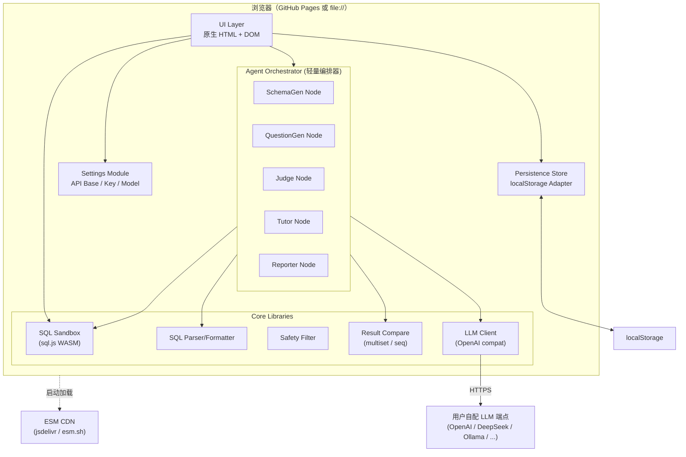
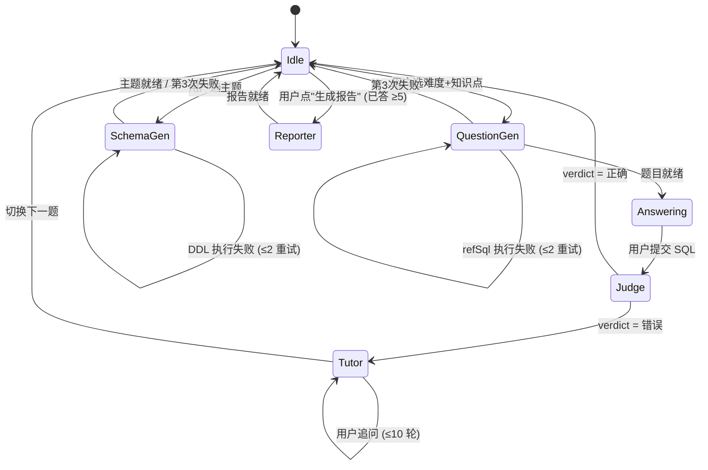
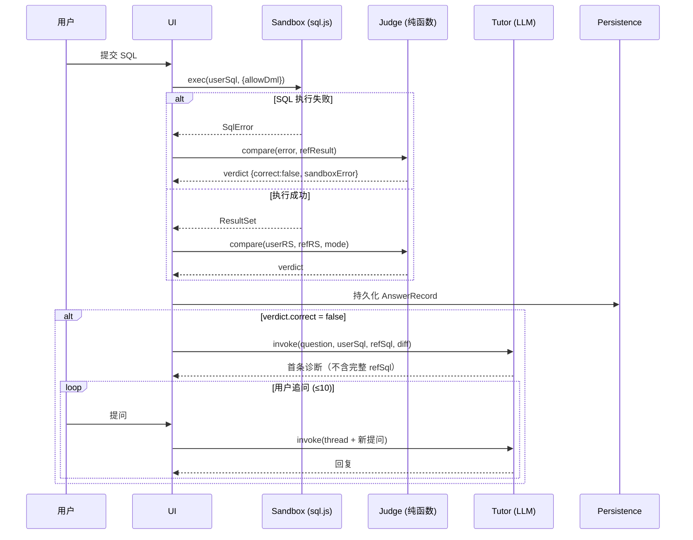

# SQL 教练 技术架构

## 系统总览

**出站请求白名单**：浏览器只对两类目标发请求 — CDN（仅启动）+ 用户自配 LLM 端点（携带 API Key）。绝不向任何第三方分析、错误上报、telemetry 服务发送数据。

## Agent 编排状态机

## 答题判题序列图

## 模块职责

| 模块 | 文件 | 职责 |
|---|---|---|
| **Settings** | `src/settings/settings.js` | LLM 配置加载/保存/清除/测试连接/掩码显示 |
| **LLM Client** | `src/llm/client.js` | OpenAI 兼容 fetch 封装 + 60s AbortController + 错误分类 |
| **LLM Errors** | `src/llm/errors.js` | 7 种错误分类 + 优先级排序 |
| **Persistence** | `src/persist/store.js` | localStorage 适配器 + 内存兜底 + 配额检测 |
| **SQL Tokenizer** | `src/sql/tokenizer.js` | 词法分析（关键字/标识符/字符串/注释） |
| **SQL Parser** | `src/sql/parser.js` | 粗粒度语法识别（语句类型 + ORDER BY 等标志位） |
| **SQL Formatter** | `src/sql/formatter.js` | 格式化（满足解析-格式化-解析往返一致性） |
| **Safety Filter** | `src/sandbox/safety-filter.js` | 拒绝 DDL / DML 关键字（基于 token 流） |
| **Sandbox** | `src/sandbox/sandbox.js` | sql.js 包装 + 快照重置 + 行数截断 + Web Worker 硬超时 |
| **Judge** | `src/judge/compare.js` | 结果集等价（multiset / sequence）+ 列名宽容 + 数值规范化 |
| **Agent: SchemaGen** | `src/orchestrator/nodes/schema-gen.js` | 按主题生成 DDL + 种子数据，3 次重试 |
| **Agent: QuestionGen** | `src/orchestrator/nodes/question-gen.js` | 按难度/知识点出题 + 后置校验器 |
| **Agent: Judge** | `src/orchestrator/nodes/judge.js` | Judge 引擎的 Agent 包装（含 set_vs_join_compare 双段） |
| **Agent: Tutor** | `src/orchestrator/nodes/tutor.js` | 错题诊断 + 多轮答疑 + 上下文隔离 |
| **Agent: Reporter** | `src/orchestrator/nodes/reporter.js` | 能力分析 + Markdown 报告 |
| **Orchestrator** | `src/orchestrator/graph.js` | 轻量节点编排（与 LangGraph.js 接口兼容） |
| **UI Views** | `src/ui/*.js` | 原生 DOM 视图（设置 / 练习 / 编辑器 / Tutor / 历史 / 报告） |
| **App Boot** | `src/main.js` | 启动 / 路由 / 状态恢复 |

## 关键设计决策

| 决策 | 替代方案 | 选择理由 |
|---|---|---|
| 自实现轻量编排 | LangGraph.js | LangGraph.js 浏览器 ESM 加载链路复杂；自实现 100 行同接口 |
| sql.js (SQLite WASM) | DuckDB-wasm | 体积小、生态成熟；MySQL 函数差异更小 |
| 仅用 SQLite ∩ MySQL 子集 | 全 SQLite 语法 | 课程对齐 MySQL |
| 判题用纯函数（不调 LLM） | LLM 判题 | 结果集等价是确定性比较；纯函数稳定、零成本、可 PBT 验证 |
| 手写解析器 | node-sql-parser | 仅需粗粒度结构识别；手写 ~300 行避免 18MB 依赖 |
| 原生 DOM | React/Vue | R4 禁止构建步骤 |
| Web Worker 沙箱 | 主线程沙箱 | sql.js 同步 exec 阻塞主线程；Worker + terminate() 实现真硬 5 秒超时 |
| 字节快照重置 | INSERT 重放 | sql.js export() 返回完整字节，O(1) 还原 |

## Correctness Properties（12 条）

每条都用 fast-check 做 ≥100 次随机测试，关联具体需求：

| # | 属性 | 关联需求 | 测试文件 |
|---|---|---|---|
| 1 | SQL 解析-格式化-解析往返一致性 | R18.1, R18.2, R18.4 | `tests/sql/parser.property.test.js` |
| 2 | 出站请求白名单（API Key 不外泄） | R1.3, R2.2, R2.4, R4.4, R10.1 | `tests/llm/client.property.test.js` |
| 3 | 凭据持久化往返与清除 | R1.2, R2.1, R2.3, R15.5 | `tests/persist/store.property.test.js` |
| 4 | LLM 错误分类的覆盖与互斥 | R3.1, R3.3, R14.1-14.4, R14.6 | `tests/llm/errors.property.test.js` |
| 5 | 沙箱重置幂等性 | R10.6, R11.4 | `tests/sandbox/sandbox.property.test.js` |
| 6 | 安全过滤的精确性 | R11.1, R11.2 | `tests/sandbox/safety-filter.property.test.js` |
| 7 | 结果集等价比较（自反/对称/multiset/sequence） | R12.1-12.7, R19.4 | `tests/judge/compare.property.test.js` |
| 8 | 题目难度/题型/排序后置校验 | R5.2, R5.3, R7.4, R8.4-8.5, R9.1-9.6, R19.1-19.3 | `tests/orchestrator/question-gen.property.test.js` |
| 9 | Agent retry 计数与失败传播 | R6.4, R6.5, R8.7, R8.8, R17.4 | `tests/orchestrator/graph.property.test.js` |
| 10 | Tutor 上下文隔离与持久化往返 | R13.3, R13.4, R13.5, R15.1-15.3 | `tests/orchestrator/tutor.property.test.js` |
| 11 | 历史排序与过滤分区 | R15.4, R15.5 | `tests/ui/history-view.property.test.js` |
| 12 | 持久化失败 ⇔ 导出入口可见 | R15.6 | `tests/ui/quota.property.test.js` |

## 数据模型

主要类型见 `src/types.js`（JSDoc typedef）：

- `LlmConfig` — API 配置三元组
- `TableSchema` / `ColumnSchema` / `ForeignKey` — 数据库结构
- `Question` — 题目（含 prompt/refSql/refSqlAlt/expectedResult/isOrdered）
- `ResultSet` — 列名 + 行数据 + 截断标记
- `JudgeVerdict` — 判定结果（含差异摘要）
- `TutorMessage` — 对话单条消息
- `AnswerRecord` — 一道题的完整作答记录
- `ClassifiedLlmError` — 7 类错误的标签联合
- `AgentState` — LangGraph 全局状态

## localStorage Schema

| Key | 内容 |
|---|---|
| `sqlcoach.settings.v1` | LlmConfig |
| `sqlcoach.schema.v1` | 当前 DDL + seedSql + 表结构 |
| `sqlcoach.questions.v1` | 题目列表 |
| `sqlcoach.answers.v1` | 答题记录 |
| `sqlcoach.sessions.v1` | 会话列表 |
| `sqlcoach.meta.schemaVersion` | 持久化 schema 版本号（用于未来迁移） |

**不持久化沙箱字节快照**：sql.js 数据库可能 >1MB，存进 5MB 配额的 localStorage 不划算。重启时用 `ddl + seedSql` 重新建库（确定性）。

## 课程对齐

系统重点覆盖以下教学难点：

- **GROUP BY + HAVING**：分组聚集
- **相关子查询**：依赖外层查询
- **EXISTS / NOT EXISTS**：存在量词
- **全称量词转化**：用 `NOT EXISTS` 模式表达
- **集合运算（差集）**：`EXCEPT` 与 `NOT IN` / `NOT EXISTS` 等价改写
- **集合查询 vs 连接查询对比**：同一语义两种写法

L3 难度强约束：必含相关子查询 / EXISTS / 全称量词 / 差集 之一。
L4 难度强约束：必组合 2 个以上知识点。

## 风险与缓解

主要风险（详见 design.md "Risks"）：

- LLM 生成不可执行 SQL → 节点出口实际执行验证 + 3 次重试
- LLM 误用 SQLite 专属语法 → 提示词约束 + 出口 token 流扫描
- sql.js 同步 exec 阻塞主线程 → Web Worker + terminate() 硬超时
- 用户 LLM 端点不允许跨域 → 启发式 CORS 检测 + 显式提示
- API Key 泄漏 → 出站白名单 PBT 守护
- localStorage 配额耗尽 → 检测 QuotaExceededError + JSON 导出兜底
- 提示词注入 → 自定义主题描述用标签包裹 + 输出仍走子集校验
